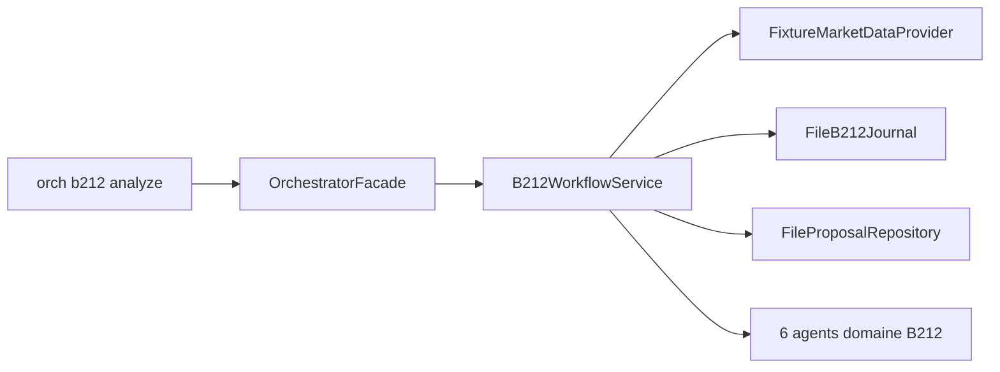

# Intégration B212 — Framework trading desk

**Crate :** `crates/b212` · **Bridge :** `orchestrator/src/b212/`

Le protocole B212 est un **enfant de l'Orchestrateur** : il consomme le Cortex pour la mémoire de marché et s'appuie sur des agents persistants dédiés.

## Architecture



## Workspace B212

```
workspace/b212/
  fixtures/       # OHLCV JSON (btc_trend_1h, …)
  journal/        # Journal d'analyse append-only
  proposals/      # Propositions HITL en attente
  sim/            # Fills paper trading
  bible/          # Référentiel stratégique
```

Activation dans `orchestrator.toml` :

```toml
[b212]
enabled = true
```

## Workflow d'analyse (6 étapes)

1. Chargement multi-timeframe (fixtures ou provider live)
2. Modules B2.1 → B2.5 (structure, liquidité, cardinal, …)
3. Scoring TLS (Trade Location Score)
4. Journalisation
5. Proposition trade (si cardinal OK)
6. Notification agents domaine

```powershell
orch b212 analyze BTCUSDT --session london --lookback 24
```

## Agents domaine

`orch b212 init-agents` crée six agents persistants (`B212_AGENTS`) :

| ID | Rôle |
|----|------|
| `b212-analyst` | Analyse structurelle |
| `b212-risk` | Gestion risque |
| `b212-execution` | Exécution simulée |
| … | Voir `orchestrator/src/b212/agents.rs` |

Messagerie inter-agents standard : `orch agent send b212-analyst b212-risk "…"`.

## Human-in-the-Loop

```powershell
orch b212 proposals list
orch b212 proposals approve <id>
orch b212 proposals reject <id> --reason "setup invalide"
orch b212 sim execute <proposal_id>
```

## Événements

Le daemon WS émet `B212Event` pour le desktop et Godot (propositions, cardinal, sim fill).

Tests :

```powershell
cargo test -p orchestrator --test phase3_b212_workflow
cargo test -p orchestrator --test integration_multi_agents_b212
```

## Extension

- **Nouveau module** : crate `b212` + branchement dans `B212WorkflowService`
- **Skill B212** : `skill_type = "b212"` dans `skill.toml` — hooks via `B212Skill`
- **Données live** : remplacer `FixtureMarketDataProvider` par un adapter exchange dans `infrastructure`