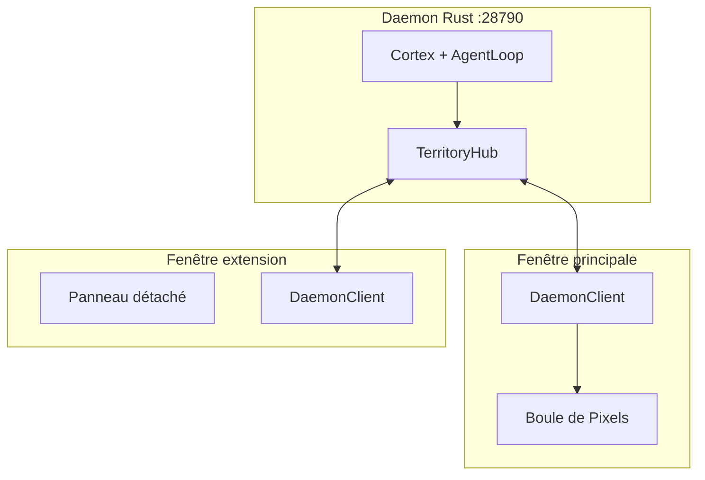

# Phase 18 — Multi-fenêtrage Avancé

**Date :** 22 juin 2026  
**Branche :** `main`  
**Version :** 0.19.0  
**Statut :** Terminé

---

## Vision

> **Le cerveau est unique. Le territoire est extensible.**

- La **Boule de Pixels Vivante** n'existe que dans la **fenêtre principale**.
- Chaque fenêtre d'extension est un **client WebSocket indépendant** du daemon Rust.
- **Aucune communication directe** entre fenêtres Godot — le daemon est la source unique de vérité.

---

## Architecture



### Règles architecturales

| Règle | Implémentation |
|-------|----------------|
| Une seule Boule | `MainTerritory.tscn` seule scène 3D avec `BrainSphere` |
| Pas de duplication d'état | Chaque fenêtre recharge via `execute_*` + `broadcast` |
| Pas de IPC Godot↔Godot | `WindowManager` gère uniquement le cycle de vie des `Window` |
| Actions critiques réservées | `Assimilate`, `ExecuteSkill` → `window_kind: main` côté daemon |
| Cohérence visuelle | Autoload `TerritoryTheme` + `DockPanel` stylé |

---

## Protocole WebSocket (extensions Phase 18)

### Handshake enrichi

```json
{
  "type": "connect",
  "token": "dev",
  "client": {
    "window_kind": "extension",
    "panels": ["graph"],
    "subscriptions": ["graph", "memories", "activity"]
  }
}
```

### `connect_ok`

```json
{
  "type": "connect_ok",
  "version": "0.19.0",
  "session_id": "uuid-client",
  "territory_session_id": "uuid-territoire"
}
```

### `broadcast`

```json
{
  "type": "broadcast",
  "territory_session_id": "uuid-territoire",
  "event": "memories_changed",
  "source_session_id": "uuid-source",
  "payload": {}
}
```

| Événement | Déclencheur | Abonnés typiques |
|-----------|-------------|------------------|
| `memories_changed` | `Assimilated`, chat auto-assimilé | memory, main |
| `graph_changed` | idem | graph, main |
| `brain_pulse` | chat, assimilation | **main uniquement** |
| `chat_reply` | `ChatReply` | chat |

Le hub filtre côté serveur : `brain_pulse` n'est envoyé qu'aux clients `window_kind: main`.

---

## Côté Godot

| Composant | Rôle |
|-----------|------|
| `WindowManager` | Ouvre `Window` + `ExtensionTerritory`, bouton ⧉ des panneaux |
| `DaemonClient` | **Par fenêtre** (plus d'autoload) — WS, reconnexion, broadcast |
| `ExtensionTerritory.tscn` | UI 2D + un panneau + `DaemonClient` dédié |
| `PanelRegistry` | Mapping `panel_id` → scène |
| `TerritoryTheme` | Style panels partagé |

### Détachement

1. Clic **⧉** sur un `DockPanel`
2. `WindowManager.open_extension(panel_id)`
3. Nouvelle fenêtre OS avec panneau frais connecté au daemon
4. La fenêtre principale conserve la Boule

### Résilience

- Reconnexion exponentielle (1s → 30s)
- Fallback HTTP `/health` si WS down
- `ping` / `pong` toutes les 25s
- Re-bootstrap (`list`, `graph`) après `connect_ok`

---

## Côté Rust

| Module | Rôle |
|--------|------|
| `daemon/hub.rs` | `TerritoryHub` — sessions, subscriptions, fan-out |
| `daemon/protocol.rs` | `ClientInfo`, `Broadcast`, `ConnectOk` enrichi |
| `daemon/server.rs` | Boucle WS `select!`, gate `requires_main_window` |

`/health` expose `territory_session_id` et `connected_clients`.

---

## Lancement

```bash
orchestrateur daemon run
# Godot → F5 (fenêtre principale)
# Clic ⧉ sur un panneau → extension
```

---

## Phase 19 (pistes)

- Replacer le panneau docké par un placeholder « ouvert en extension »
- Broadcast `activity` sur changement d'état Health (debounce)
- Persistance layout multi-fenêtres

---

**Fin de la Phase 18**