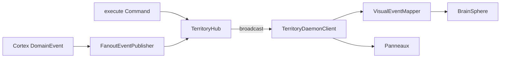

# Phase 19 — Intégration Réelle avec le Cœur Orchestrateur

**Date :** 22 juin 2026  
**Branche :** `main`  
**Version :** 0.20.0  
**Statut :** Terminé

---

## Objectif

Connecter le Territoire Graphique au **vrai backend** Rust (`Cortex` + `AgentLoop`) : la Boule et les panneaux réagissent aux événements réels (assimilation, tool calls, recherche, graphe, erreurs).

---

## Architecture



### Règles

| Couche | Responsabilité |
|--------|----------------|
| **Rust `TerritoryHub`** | Émet les broadcasts depuis `Response` + `DomainEvent` |
| **`TerritoryDaemonClient`** | WS, reconnexion, routage données + signaux visuels |
| **`VisualEventMapper`** | Mapping événement → effet (pulse, swirl, stress, shake) |
| **`BrainSphere`** | Rendu shader + particules (pas de logique métier) |

---

## Événements supportés

| Événement WS | Source | Effet visuel Godot |
|--------------|--------|-------------------|
| `memory_assimilated` | `Assimilated` / `DomainEvent` | Forte pulsation + swirl + particules |
| `tool_call` | `ChatReply.tools_invoked` | Flash rotation |
| `vector_search` | `SearchResults` | Ondulation swirl particules |
| `brain_pulse` | Chat, assimilation, search | Pulsation paramétrée |
| `graph_changed` | Graphe / domaine | Refresh panneau Graph |
| `memories_changed` | Assimilation | Refresh Memory List |
| `system_error` | `Response::Error` | Teinte rouge + tremblement |
| `degraded_mode` | Health dégradé / erreur LLM | Stress shader + veille |
| `chat_reply` | Agent | Panneau Chat |

---

## Côté Rust

- Daemon démarre avec **`FanoutEventPublisher`** (`daemon run` dédié)
- Tâche async relaie `DomainEvent` → `broadcast_all`
- `events_from_response` enrichi : Search, Chat tools, Error, Graph

---

## Côté Godot

| Fichier | Rôle |
|---------|------|
| `visual_event_mapper.gd` | Mapping + throttling 100ms |
| `brain_sphere.gd` | `apply_visual_effect()`, mode dégradé |
| `brain_living_shader.gdshader` | Uniforms `stress`, `swirl` |
| `territory_manager.gd` | Relie `visual_event` → boule |
| `daemon_client.gd` | Subscriptions Phase 19, signaux réels |

### Mode dégradé

- WS down → respiration lente (`idle_breathing`) + stress léger
- HTTP fallback → monitoring orange
- `degraded` Health → teinte ambre shader

---

## Lancement

```bash
$env:ORCHESTRATEUR_DAEMON_TOKEN = "dev"
orchestrateur daemon run --workspace workspace
# Godot F5 — interactions réelles via panneaux
```

---

## Tests

```bash
cargo test -p orchestrator --features websocket-server
```

---

**Fin de la Phase 19**