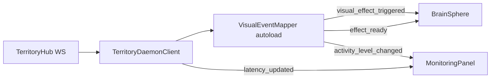

# Phase 20 — Polish Final & Visuel Impressionnant

**Date :** 22 juin 2026  
**Branche :** `main`  
**Version :** 0.21.0  
**Statut :** Terminé

---

## Objectif

Livrer un **Territoire Graphique** visuellement impressionnant, fluide et prêt à démonstration : mapper centralisé, shader final, particules réactives, transitions professionnelles et robustesse opérationnelle.

---

## Architecture Phase 20



### Séparation des responsabilités

| Couche | Rôle |
|--------|------|
| **Rust `TerritoryHub`** | Événements domaine + broadcasts |
| **`TerritoryDaemonClient`** | WS, reconnexion backoff, latence ping/pong |
| **`VisualEventMapper`** | Traduction événement → effet, throttling 30 Hz |
| **`BrainSphere`** | Shader + particules (aucune logique métier) |

---

## VisualEventMapper (autoload)

- Nœud autoload `/root/VisualEventMapper` (sans `class_name` — évite conflit Godot)
- Signaux : `visual_effect_triggered`, `effect_ready`, `activity_level_changed`
- API : `map_backend_event()`, `update_global_activity()`, `set_degraded_mode()`, `emit_idle_breathing()`
- Throttling : **30 mises à jour/seconde** (`THROTTLE_SECS = 1/30`)
- Priorité aux effets critiques : assimilation, erreur, dégradé, tool_call

### Événements mappés

| Événement | Effet visuel |
|-----------|--------------|
| `memory_assimilated` | Pulse fort + swirl + particules entrantes |
| `tool_call` | Flash rotation + burst explosif |
| `vector_search` | Swirl léger |
| `graph_changed` / `graph_updated` | Ondulation + refresh graphe |
| `agent_activity` | Niveau global mapper (0–3) |
| `system_error` | Stress rouge + shake |
| `degraded_mode` | Teinte ambre + respiration lente |

---

## Améliorations visuelles

### Shader vFinal (`brain_living_shader.gdshader`)

- Surface vivante permanente (`living` uniform)
- Réfraction légère simulée (`refraction_strength`)
- Glow réactif à l'activité réelle + fresnel renforcé
- Mode dégradé : couleurs ternes, réfraction réduite, rotation ralentie

### Particules avancées (`BrainSphere.tscn`)

| Système | Comportement |
|---------|--------------|
| `ParticlesIdle` | Respiration lente, orbite douce |
| `ParticlesAssimilation` | Flux entrant (radial_accel négatif) |
| `ParticlesTool` | Burst one-shot explosif |

Budget global : **300 particules max** — limitation intelligente par couche.

---

## Robustesse

| Fonctionnalité | Implémentation |
|----------------|----------------|
| Throttling visuel | 30 Hz dans `VisualEventMapper` |
| Reconnexion WS | Backoff exponentiel 1s → 30s (Phase 18/19) |
| Mode dégradé | Couleurs ternes, particules réduites, mapper + boule synchronisés |
| Latence | RTT ping/pong → `MonitoringPanel` |
| Fermeture fenêtres | `WindowManager.close_all_extensions()` + `ExtensionTerritory.cleanup()` |

---

## Fichiers modifiés

| Fichier | Changement |
|---------|------------|
| `visual_event_mapper.gd` | Autoload Node + signaux |
| `brain_sphere.gd` | Connexion mapper, 3 modes particules |
| `brain_living_shader.gdshader` | vFinal |
| `BrainSphere.tscn` | 3 systèmes GPUParticles3D |
| `daemon_client.gd` | Routage mapper, latence |
| `territory_manager.gd` | Monitoring latence/mapper |
| `monitoring_panel.gd` | Latence + niveau mapper |
| `window_manager.gd` | Fermeture propre extensions |
| `project.godot` | Autoload `VisualEventMapper` |

---

## État final du PoC

À l'issue de la Phase 20, le Territoire Graphique offre :

- Une **Boule de Pixels Vivante** impressionnante et réactive
- Un **multi-fenêtrage** cohérent (extensions = territoire partagé)
- Une communication **WebSocket stable** avec le backend Rust
- Des **panneaux dockables** fonctionnels
- Un **VisualEventMapper** centralisé et extensible
- Une bonne **résilience** (reconnexion, mode dégradé, latence affichée)

---

## Démonstration

```powershell
# Terminal 1 — daemon
cd C:\GitDev\Projet\orchestrateur
cargo run -p cli -- daemon run

# Terminal 2 — Godot
# Ouvrir territoire-graphique/godot-project/ → F5
```

Token : `ORCHESTRATEUR_DAEMON_TOKEN=dev` (défaut).