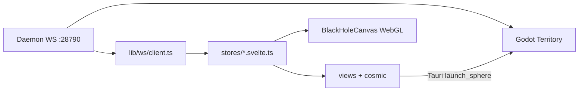

# UI Event Horizon — Design System & Architecture

**Projet :** Orchestrateur  
**Thème :** Black Hole Réaliste (Event Horizon)  
**Version :** 1.0 · **Date :** Juin 2026  
**Niveau :** High-Tech / Professionnel / Cinématographique  
**Clients :** `apps/tauri-desktop` (Svelte 5) · `territoire-graphique` (Godot 4.7)

> Document canonique UI. Complète [`architecture.md`](architecture.md) et [`protocol-ws.md`](protocol-ws.md).  
> Référence desktop : [`apps/tauri-desktop/README.md`](../apps/tauri-desktop/README.md)

---

## 1. Vision & direction artistique

### Concept

L'interface est **incrustée dans l'environnement d'un trou noir réaliste**. L'utilisateur opère depuis la zone proche de l'horizon des événements — le Cortex est le centre gravitationnel, les agents orbitent, les messages sont des faisceaux synaptiques.

### Ambiance

- Sombre, calme, puissante
- Style *institutional sci-fi* (Interstellar × The Expanse)
- Finition 2026 : glassmorphism, shaders physiques, micro-animations

### Double couche visuelle

| Couche | Technologie | Rôle |
|--------|-------------|------|
| **Event Horizon (fond)** | WebGL + textures précalculées (ebruneton) | Trou noir, disque d'accrétion, lentille gravitationnelle |
| **Command Deck (UI)** | Svelte 5 + CSS tokens | Panneaux, chat, agents, drawers |
| **Territoire 3D** | Godot WS client | Sphères agents, arcs communication, monitoring |

---

## 2. Palette & tokens

### Tokens Event Horizon (cible v1.0)

Variables CSS à intégrer dans `apps/tauri-desktop/src/cosmic-tokens.css` :

```css
:root {
  /* ——— Void & profondeur ——— */
  --bg-void: #000000;
  --bg-deep: #0a0f1e;
  --bg-glass: rgba(10, 15, 30, 0.72);

  /* ——— Accrétion & énergie ——— */
  --accent-core: #ff6b00;
  --accent-hot: #ffe0b3;
  --accent-cyan: #00e5ff;
  --accent-purple: #7b2cbf;

  /* ——— Texte ——— */
  --text-primary: #e0e7ff;
  --text-secondary: #8ba1c7;
  --text-muted: #5a6b8c;

  /* ——— Surfaces ——— */
  --border-glass: rgba(0, 229, 255, 0.18);
  --shadow-glass: 0 8px 32px rgba(0, 0, 0, 0.6);
}
```

### Palette implémentée (Apparence 2 — source de vérité actuelle)

Alignée Web ↔ Godot via `cosmic-palette.ts` :

```typescript
// apps/tauri-desktop/src/lib/cosmic/cosmic-palette.ts
export const COSMIC_PALETTE = {
  void: { hex: "#0a0a12" },
  diskHot: [1.0, 0.28, 0.04],      // disque chaud (accrétion)
  diskCold: [0.38, 0.68, 1.0],     // disque froid
  photonRing: [1.0, 0.96, 0.88],   // anneau de photons
  rimCyan: [0.2, 0.95, 1.0],
  sky: [160/255, 196/255, 224/255],
  mauve: [200/255, 168/255, 208/255],
  kind: { decision, dead_end, pattern, context, progress, business },
};
```

**Règle de convergence :** les tokens Event Horizon (`--accent-core`, `--accent-hot`) remplacent progressivement `--status-orange` / teintes apricot pour le disque ; `--accent-cyan` reste l'accent UI principal.

### Effets visuels clés

| Effet | Implémentation | Fichier |
|-------|----------------|---------|
| Gravitational lensing | Textures `deflection.dat` + `inverse_radius.dat` | `cosmic-bh-assets.ts` |
| Accretion disk lighting | Shader fragment + `diskHot` / `diskCold` | `BlackHoleCanvas.svelte` |
| Glassmorphism | `.glass-panel`, `.glass-message` | `cosmic-tokens.css` |
| Particules orbitales | Hits orbitaux + ceinture agents | `agent-belt-renderer.ts` |
| Ondes gravitationnelles | `triggerFeedBurst()` sur action agent | `blackhole.svelte.ts` |
| Arcs synaptiques 3D | Bézier + ruban double couche | `communication_lines.gd` |

---

## 3. Architecture UI globale

### Structure réelle (Juin 2026)

```
apps/tauri-desktop/src/
├── App.svelte                    # Racine → CosmicShell
├── app.css                       # Tailwind + glow-card
├── cosmic-tokens.css             # Design tokens CSS
├── cosmic-harness.ts             # Bootstrap layout BH
├── lib/
│   ├── cosmic/                   # ★ Shell Event Horizon
│   │   ├── CosmicShell.svelte    # Layout principal
│   │   ├── BlackHoleCanvas.svelte
│   │   ├── ConversationPane.svelte
│   │   ├── ConstellationDrawer.svelte
│   │   ├── cosmic-palette.ts
│   │   ├── cosmic-bh-assets.ts
│   │   ├── blackhole-layout.ts
│   │   └── agent-belt-renderer.ts
│   ├── views/                    # Vues métier
│   │   ├── Agents.svelte
│   │   ├── AgentDetail.svelte
│   │   └── CommunicationGraph.svelte
│   ├── components/               # Composants réutilisables
│   │   ├── GlowCard.svelte
│   │   ├── StatusIndicator.svelte
│   │   ├── MetricBadge.svelte
│   │   └── agents/*
│   ├── stores/                   # État Svelte 5 ($state)
│   │   ├── connection.svelte.ts
│   │   ├── agents.svelte.ts
│   │   ├── blackhole.svelte.ts
│   │   └── navigation.svelte.ts
│   ├── ws/                       # Bridge daemon WS 1.2.0
│   └── generated/                # Types ts-rs
```

### Structure cible (refactor optionnel)

```
apps/tauri-desktop/src/
├── layouts/
│   ├── MainLayout.svelte         # ← extrait de CosmicShell
│   └── CommandDeckLayout.svelte  # mode immersif plein écran
├── views/
│   ├── AgentsDashboard.svelte    # alias Agents.svelte
│   ├── CommunicationHub.svelte   # alias CommunicationGraph.svelte
│   └── TerritoryView.svelte      # embed Godot / launch Tauri
└── components/ui/
    ├── Button.svelte
    ├── Card.svelte
    ├── StatusOrb.svelte
    └── HolographicPanel.svelte
```

### Flux de données



---

## 4. Design System — composants

### 4.1 Button.svelte (spec + implémentation cible)

```svelte
<script lang="ts">
  import type { Snippet } from "svelte";

  type Variant = "primary" | "ghost" | "danger" | "accent";
  type Size = "sm" | "md" | "lg";

  let {
    variant = "primary",
    size = "md",
    disabled = false,
    type = "button",
    onclick,
    children,
  }: {
    variant?: Variant;
    size?: Size;
    disabled?: boolean;
    type?: "button" | "submit";
    onclick?: (e: MouseEvent) => void;
    children?: Snippet;
  } = $props();
</script>

<button
  {type}
  class="eh-btn eh-btn--{variant} eh-btn--{size}"
  {disabled}
  {onclick}
>
  {@render children?.()}
</button>

<style>
  .eh-btn {
    border-radius: var(--radius-md);
    font-weight: 500;
    letter-spacing: 0.02em;
    transition: box-shadow 0.2s, border-color 0.2s, transform 0.15s;
    border: 1px solid var(--border-glass);
    background: var(--bg-glass, var(--glass-bg));
    color: var(--text-primary);
    backdrop-filter: blur(12px);
  }
  .eh-btn--primary {
    border-color: rgba(0, 229, 255, 0.35);
    box-shadow: 0 0 20px rgba(0, 229, 255, 0.12);
  }
  .eh-btn--accent {
    border-color: rgba(255, 107, 0, 0.45);
    color: var(--accent-hot, var(--accent-core));
  }
  .eh-btn--sm { padding: 0.25rem 0.625rem; font-size: 0.75rem; }
  .eh-btn--md { padding: 0.5rem 1rem; font-size: 0.875rem; }
  .eh-btn--lg { padding: 0.75rem 1.25rem; font-size: 1rem; }
  .eh-btn:hover:not(:disabled) {
    transform: translateY(-1px);
    box-shadow: var(--shadow-glass, var(--glow-cyan));
  }
  .eh-btn:disabled { opacity: 0.45; cursor: not-allowed; }
</style>
```

### 4.2 Card.svelte — effet gravitationnel sur les bords

**Existant :** `GlowCard.svelte` + classe `.glow-card` dans `app.css`.

```svelte
<!-- apps/tauri-desktop/src/lib/components/GlowCard.svelte (existant) -->
<section class="glow-card p-4 {className}">
  {#if header}{@render header()}{:else if title}…{/if}
  {#if children}{@render children()}{/if}
</section>
```

**Cible Event Horizon — Card avec lentille :**

```svelte
<script lang="ts">
  import type { Snippet } from "svelte";
  let { class: className = "", children }: { class?: string; children?: Snippet } = $props();
</script>

<div class="eh-card {className}">
  <div class="eh-card__lens" aria-hidden="true"></div>
  <div class="eh-card__content">
    {@render children?.()}
  </div>
</div>

<style>
  .eh-card {
    position: relative;
    border-radius: var(--radius-lg);
    overflow: hidden;
    background: var(--bg-glass, var(--glass-bg));
    border: 1px solid var(--border-glass, var(--glass-border));
    box-shadow: var(--shadow-glass);
  }
  .eh-card__lens {
    position: absolute;
    inset: -1px;
    pointer-events: none;
    background: radial-gradient(
      ellipse 120% 80% at 50% 0%,
      rgba(0, 229, 255, 0.08) 0%,
      transparent 55%
    );
    mask-image: linear-gradient(180deg, #000 0%, transparent 40%);
  }
  .eh-card__content {
    position: relative;
    padding: var(--space-4);
    backdrop-filter: blur(16px);
  }
</style>
```

### 4.3 StatusOrb.svelte — statut agent temps réel

**Existant proche :** `StatusIndicator.svelte`.

```svelte
<script lang="ts">
  type AgentStatus = "awake" | "sleeping" | "background" | "error" | "idle";

  let { status = "idle", label }: { status?: AgentStatus; label?: string } = $props();

  const palette: Record<AgentStatus, { core: string; glow: string }> = {
    awake:      { core: "var(--accent-cyan)", glow: "rgba(0,229,255,0.5)" },
    background: { core: "var(--accent-purple,#7b2cbf)", glow: "rgba(123,44,191,0.45)" },
    sleeping:   { core: "var(--text-muted)", glow: "transparent" },
    error:      { core: "var(--status-red)", glow: "rgba(232,138,138,0.5)" },
    idle:       { core: "var(--text-muted)", glow: "transparent" },
  };
  const p = $derived(palette[status]);
</script>

<span
  class="status-orb"
  class:status-orb--pulse={status === "awake" || status === "background"}
  role="status"
  aria-label={label ?? status}
  title={label}
>
  <span class="status-orb__core" style="background:{p.core}; box-shadow: 0 0 12px {p.glow}"></span>
</span>

<style>
  .status-orb {
    display: inline-flex;
    width: 0.75rem;
    height: 0.75rem;
    align-items: center;
    justify-content: center;
  }
  .status-orb__core {
    width: 100%;
    height: 100%;
    border-radius: 9999px;
    transition: background 0.3s, box-shadow 0.3s;
  }
  .status-orb--pulse .status-orb__core {
    animation: orb-pulse 2s ease-in-out infinite;
  }
  @keyframes orb-pulse {
    0%, 100% { transform: scale(1); opacity: 1; }
    50% { transform: scale(0.88); opacity: 0.75; }
  }
</style>
```

### 4.4 HolographicPanel.svelte — panneau Command Deck

```svelte
<script lang="ts">
  import type { Snippet } from "svelte";
  let {
    title,
    children,
    class: className = "",
  }: { title?: string; children?: Snippet; class?: string } = $props();
</script>

<aside class="holo-panel {className}">
  <div class="holo-panel__chromatic" aria-hidden="true"></div>
  {#if title}
    <header class="holo-panel__header">{title}</header>
  {/if}
  <div class="holo-panel__body scroll-thin">
    {@render children?.()}
  </div>
</aside>

<style>
  .holo-panel {
    position: relative;
    display: flex;
    flex-direction: column;
    min-height: 0;
    border: 1px solid var(--border-glass);
    background: linear-gradient(
      165deg,
      rgba(10, 15, 30, 0.85) 0%,
      rgba(10, 15, 30, 0.55) 100%
    );
    backdrop-filter: blur(20px);
    border-radius: var(--radius-lg);
    box-shadow: var(--shadow-glass);
  }
  .holo-panel__chromatic {
    position: absolute;
    inset: 0;
    border-radius: inherit;
    pointer-events: none;
    background: linear-gradient(
      90deg,
      rgba(255, 0, 80, 0.03) 0%,
      transparent 30%,
      transparent 70%,
      rgba(0, 229, 255, 0.04) 100%
    );
  }
  .holo-panel__header {
    padding: var(--space-3) var(--space-4);
    font-size: 0.75rem;
    font-weight: 600;
    text-transform: uppercase;
    letter-spacing: 0.08em;
    color: var(--accent-cyan);
    border-bottom: 1px solid var(--border-glass);
  }
  .holo-panel__body {
    flex: 1;
    overflow: auto;
    padding: var(--space-4);
  }
</style>
```

### 4.5 Catalogue composants existants

| Composant | Fichier | Usage |
|-----------|---------|-------|
| `GlowCard` | `components/GlowCard.svelte` | Cartes agents, métriques |
| `StatusIndicator` | `components/StatusIndicator.svelte` | Badge statut + pulse |
| `MetricBadge` | `components/MetricBadge.svelte` | KPI compacts |
| `KindBadge` | `components/KindBadge.svelte` | Kind mémoire cosmique |
| `NotificationToast` | `components/NotificationToast.svelte` | Feedback actions |
| `CommandPalette` | `components/CommandPalette.svelte` | ⌘K navigation |
| `AgentActions` | `components/agents/AgentActions.svelte` | Wake / sleep / delete |
| `MessageCenter` | `components/agents/MessageCenter.svelte` | Inbox agent |
| `HeartbeatViewer` | `components/agents/HeartbeatViewer.svelte` | Heartbeat.md live |

---

## 5. Vues principales

> **Statut Point 2 (Juin 2026) :** ✅ livré — grille `AgentCard`, `CommunicationHub` avec filtre, `AgentDetail` polish Event Horizon, `TerritoryView` iframe + fallback natif.

### 5.1 AgentsDashboard — `Agents.svelte` ✅

**Fichiers :**
- `apps/tauri-desktop/src/lib/views/Agents.svelte` — vue principale
- `apps/tauri-desktop/src/lib/views/AgentsDashboard.svelte` — alias réexport
- `apps/tauri-desktop/src/lib/components/agents/AgentCard.svelte` — carte `eh-card`

| Zone | Comportement |
|------|--------------|
| Header | Compteurs total / actifs, bouton Hub, refresh WS |
| Filtres | `AgentFilters` — rôle, statut, recherche |
| Grille | `.agents-grid` (`minmax(320px, 1fr)`) + `AgentCard` |
| Modes | `list` · `detail` · `communication` via `agentsStore.viewMode` |

```svelte
<!-- Extrait pattern navigation -->
{#if agentsStore.viewMode === "detail"}
  <AgentDetailView />
{:else if agentsStore.viewMode === "communication"}
  <CommunicationHub />
{:else}
  <GlowCard title="Sub-Agents">
    <div class="agents-grid">…</div>
  </GlowCard>
{/if}
```

**Tokens CSS :** `.agents-dashboard`, `.agents-grid`, `.eh-card` dans `cosmic-tokens.css` (lentille gravitationnelle, accretion disk, glassmorphism).

### 5.2 AgentDetail — `AgentDetail.svelte` ✅

| Section | Composant |
|---------|-----------|
| En-tête | `eh-card` + `StatusIndicator` |
| Identité | `EhSectionTitle` + `MetricBadge` × 4 |
| Actions | `AgentActions` — wake, sleep, delete |
| Heartbeat | `HeartbeatViewer` dans `eh-detail-section` |
| Mémoires agent | `MemoryExplorer` |
| Messages | `MessageCenter` |

### 5.3 CommunicationHub — `CommunicationHub.svelte` ✅

**Fichiers :**
- `apps/tauri-desktop/src/lib/views/CommunicationHub.svelte` — hub principal
- `apps/tauri-desktop/src/lib/views/CommunicationGraph.svelte` — alias réexport

- Graphe SVG 2D animé (`.comm-hub__edge`) — poids = `edge.count`
- **Filtre agent** : chips + `communicationStore.filterAgentId` → `filteredEdges` / `filteredLog`
- `MessageLog` accepte `entries` optionnel (journal filtré)
- Complété côté Godot par arcs 3D synaptiques (`communication_lines.gd`)
- Store : `communicationStore.edges` alimenté par événements WS `agent_message`

**Tests :** `apps/tauri-desktop/src/lib/stores/communication-filters.test.ts`

### 5.4 TerritoryView — intégration Godot ✅

**Fichiers :**
- `apps/tauri-desktop/src/lib/views/TerritoryView.svelte` — overlay fullscreen
- `territoire-graphique/godot-project/scenes/TerritoryEmbed.tscn` — scène légère embed
- `territoire-graphique/godot-project/scripts/territory_embed.gd`
- `territoire-graphique/godot-project/export_presets.cfg` — preset « Web Embed »
- `scripts/export-godot-web.ps1` → `apps/tauri-desktop/public/godot/`
- `apps/tauri-desktop/public/godot/index.html` — placeholder jusqu'à export WASM

| Action UI | Mécanisme | Scène Godot |
|-----------|-----------|-------------|
| Territoire embed | iframe `/godot/index.html` + `localStorage.orchestrateur_daemon_token` | `TerritoryEmbed.tscn` |
| Ouvrir Sphère | `launch_sphere_window` (Tauri) | `SphereDedicated.tscn` |
| Ouvrir Territoire natif | `launch_territory_window` (Tauri) | `MainTerritory.tscn` |
| Extension panneau | Godot `window_kind: extension` | panneaux détachés |

**Navigation :** `navigationStore.territoryOverlayOpen` · entrée EscMenu « Territoire (embed) » · `Esc` ferme l'overlay · DashboardPanel bouton « Territoire embed ».

**Daemon web :** `daemon_client.gd` lit `localStorage.orchestrateur_daemon_token` sous feature `web`.

**Raccourcis CosmicShell :**

| Touche | Action |
|--------|--------|
| `⌘K` / `Ctrl+K` | Palette commandes |
| `Esc` | Menu / fermer overlays |
| `[` | Drawer gauche (constellation) |
| `]` | Drawer insights (watcher, drafts) |

### 5.5 CosmicShell — layout Event Horizon

`CosmicShell.svelte` assemble :

1. `AgentPresenceStrip` — ceinture agents autour du BH
2. `CosmicTickerHeader` — statut daemon / mémoires
3. `ConversationPane` — chat + `BlackHoleCanvas` fullscreen
4. `ConstellationDrawer` / `InsightsPanel` — panneaux latéraux
5. `EscMenu` — Command Deck overlay

---

## 6. Black Hole réaliste — pipeline technique

### 6.1 Architecture rendu

```
BlackHoleCanvas.svelte
├── Canvas WebGL (shader principal)
│   └── Textures précalculées ebruneton
│       ├── /cosmic/precomputed/deflection.dat
│       └── /cosmic/precomputed/inverse_radius.dat
├── Couche Three.js (orbites, ceinture agents)
└── Overlay 2D (légende, hits orbitaux)
```

### 6.2 États du trou noir — `blackholeStore`

| État | UI | Layout |
|------|-----|--------|
| `expanded` | BH centre écran, chat atténué | `dockT = 0` |
| `docked` | Mini-orbite coin haut-droit | `dockT = 1` |
| Scroll chat | Transition fluide | `blackholeStateFromScroll()` |

```typescript
// blackhole-layout.ts — interpolation centre ↔ orbite dockée
export function computeBlackholeLayout(width, height, dockT) {
  const t = Math.max(0, Math.min(1, dockT));
  return {
    cx: expandedCx + (dockedCx - expandedCx) * t,
    cy: expandedCy + (dockedCy - expandedCy) * t,
    baseRadius: expandedR + (dockedR - expandedR) * t,
    chatFade: 1 - t * 0.35,
  };
}
```

### 6.3 Précalcul assets

```powershell
# Génération textures (depuis dépôt)
.\scripts\cosmic-precompute-assets.ps1
```

Fichiers produits → `apps/tauri-desktop/public/cosmic/precomputed/`.

### 6.4 Feedback gravitationnel sur actions

```typescript
// Déclencher une onde lors d'un tour agent ou assimilation
blackholeStore.triggerFeedBurst();
blackholeStore.setThinking(true);  // intensité disque pendant LLM
```

Événements WS mappés dans `visual_event_mapper.gd` (Godot) et stores desktop.

---

## 7. Intégration Godot (Territoire Graphique)

### 7.1 Scènes existantes

| Scène | Fichier | Rôle | Priorité |
|-------|---------|------|----------|
| Territoire principal | `scenes/MainTerritory.tscn` | Monitoring + agents 3D | ★★★★★ |
| Sphère dédiée | `scenes/SphereDedicated.tscn` | Visualisation cortex | ★★★★★ |
| Agent sphère | `scenes/AgentSphere.tscn` | Nœud agent individuel | ★★★★★ |
| Neural brain | `scenes/ai_neural_brain/AINeuralBrainSphere.tscn` | Sphère premium | ★★★★ |

### 7.2 Scènes cibles Event Horizon v1.1

| Scène | Fichier cible | Description |
|-------|---------------|-------------|
| Event Horizon | `scenes/EventHorizon.tscn` | Environnement BH + disque accrétion unifié |
| Agent Node | `scenes/AgentNode.tscn` | Alias enrichi `AgentSphere.tscn` |
| Communication Beam | intégré dans `CommunicationLines` | Faisceau synaptique |
| Command Deck | `scenes/CommandDeck.tscn` | Poste de commandement immersif |

### 7.3 Scripts Godot critiques

| Script | Rôle |
|--------|------|
| `scripts/agents/communication_lines.gd` | Arcs Bézier, pool rubans, packets, bursts |
| `scripts/visual_event_mapper.gd` | WS → pulse cortex / arcs |
| `scripts/agents/territory_agents.gd` | Registre agents 3D + daemon |
| `scripts/daemon_client.gd` | Client WS protocole 1.2.0 |
| `scripts/agents/agent_sphere.gd` | Pulse émission sur wake/message |

### 7.4 Shaders communication (Phase 5)

```
shaders/agents/
├── communication_arc.gdshader    # Ruban double couche
├── communication_packet.gdshader # Packet lumineux sur arc
└── communication_burst.gdshader    # Éclat arrivée message
```

### 7.5 Protocole Tauri ↔ Godot

```
Desktop Svelte                    Godot Territory
     │                                  │
     │  Tauri command launch_*          │
     ├─────────────────────────────────►│ spawn process
     │                                  │
     │  ws://127.0.0.1:28790/ws         │
     ├─────────────────────────────────►│ daemon_client.gd
     │  BackendEvent (agent_message)    │
     │◄─────────────────────────────────┤ visual_event_mapper
```

Test manuel : `orch agent send analyst trader "hello"` → arc synaptique visible dans Godot.

---

## 8. Expérience utilisateur

### Navigation

- **Cosmos → System → Surface** : niveaux de zoom `cosmicStore.zoomLevel`
- **Mode Command Deck** : `EscMenu` plein écran, fond BH docké
- **Notifications** : toasts discrets coin inférieur, auto-dismiss 4s

### Accessibilité

```css
/* CosmicShell — respect prefers-reduced-motion */
.reduce-motion .cosmic-breathe,
.reduce-motion .status-pulse,
.reduce-motion .status-orb--pulse {
  animation: none !important;
}
```

- Contraste texte : `--text-primary` sur `--bg-deep` ≥ 7:1
- Focus visible : `:focus-visible` cyan (`app.css`)
- Labels ARIA sur `StatusIndicator`, graphe SVG, `BlackHoleCanvas`

### Performance cible

| Métrique | Objectif |
|----------|----------|
| UI Svelte | 60 fps interactions |
| WebGL BH | ≤ 4 ms/frame GPU mid-range |
| Godot arcs | Pool max 20 arcs actifs |
| WS latency | < 50 ms localhost |

**Bonnes pratiques Svelte 5 :**

- Stores fins — pas de re-render global sur tick WS
- `$derived` pour filtres agents / edges
- Canvas BH : une seule `requestAnimationFrame` loop
- Lazy load vues agents (`viewMode` switch)

---

## 9. Procédures développeur

### Ajouter un composant UI

1. Créer dans `lib/components/ui/` (ou `components/` si métier)
2. Utiliser tokens `cosmic-tokens.css` — pas de couleurs en dur
3. Exporter via barrel si nécessaire
4. Test Vitest si logique (voir `cosmic-palette.test.ts`)

### Aligner une couleur Godot

1. Modifier `cosmic-palette.ts`
2. Répercuter dans `starfield_background.gdshader` ou `core_plasma.gdshader`
3. `npm test` dans `apps/tauri-desktop`

### Ajouter un effet BH

1. Shader / uniforme dans `BlackHoleCanvas.svelte`
2. Si lentille : étendre `cosmic-bh-assets.ts`
3. Tester docked + expanded + `prefers-reduced-motion`

### Lancer stack complète

```powershell
# Terminal 1
just daemon

# Terminal 2
just desktop-dev

# Terminal 3 (optionnel)
just godot-territoire
```

---

## 10. Fichiers clés — état & roadmap

| Fichier | Statut |
|---------|--------|
| `src/cosmic-tokens.css` | ✅ Tokens Apparence 2 |
| `src/lib/cosmic/cosmic-palette.ts` | ✅ Sync Godot |
| `src/lib/cosmic/BlackHoleCanvas.svelte` | ✅ BH WebGL |
| `src/lib/components/GlowCard.svelte` | ✅ Card de base |
| `src/lib/views/Agents.svelte` | ✅ Dashboard agents |
| `src/lib/views/AgentDetail.svelte` | ✅ Détail agent |
| `src/lib/views/CommunicationGraph.svelte` | ✅ Hub comm 2D |
| `src/lib/components/ui/Button.svelte` | 🔲 Spec §4.1 |
| `src/lib/components/ui/StatusOrb.svelte` | 🔲 Spec §4.3 |
| `src/lib/components/ui/HolographicPanel.svelte` | 🔲 Spec §4.4 |
| `territoire-graphique/.../EventHorizon.tscn` | 🔲 Roadmap v1.1 |
| `territoire-graphique/.../CommandDeck.tscn` | 🔲 Roadmap v1.1 |

---

## 11. Références

| Document | Lien |
|----------|------|
| Architecture système | [`ARCHITECTURE.md`](ARCHITECTURE.md) |
| Protocole WS | [`protocol-ws.md`](protocol-ws.md) |
| Godot stable | [`territoire-graphique/godot-project/docs/GODOT_STABLE_REFERENCE.md`](../territoire-graphique/godot-project/docs/GODOT_STABLE_REFERENCE.md) |
| Communication Godot | [`territoire-graphique/communication.md`](../territoire-graphique/communication.md) |
| Guide utilisateur | [`USER_GUIDE.md`](USER_GUIDE.md) |

---

**Fin du document UI Event Horizon v1.0**