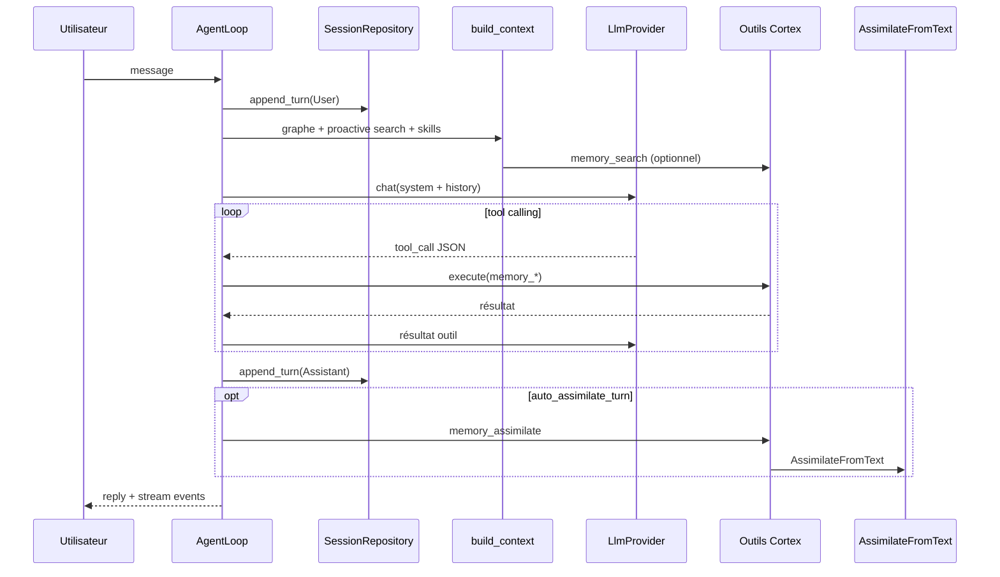

# Contrat Agent ↔ Cortex

**Version :** 2.0 · **Date :** 23 juin 2026 · **Statut :** Figé pour v0.28+

**Source de vérité Rust :** `crates/cortex/src/ports/agent_ports.rs`

> Ce document formalise la frontière entre la **boucle agent** (`orchestrator::agent`) et le **Cortex** (`cortex` + adapters `infrastructure`). Il complète [`architecture.md`](architecture.md) et [`protocol-ws.md`](protocol-ws.md).

## Principe

| Couche | Crate | Responsabilité |
|--------|-------|----------------|
| **Domaine** | `cortex` | Entités (`Memory`, `MemoryDraft`, `KnowledgeGraph`), ports hexagonaux, services purs |
| **Application** | `orchestrator` | `AgentLoop`, use cases, outils, LLM, sécurité |
| **Infrastructure** | `infrastructure` | `FileMemoryRepository`, `LancedbVectorStore`, `OllamaEmbeddingProvider`, `SqliteSessionStore` |

L'agent **ne persiste jamais directement** : il passe par des **outils** ou des **use cases** qui appellent les ports Cortex.

---

## 1. Ports Agent ↔ Cortex (contrat v2)

Définis dans `crates/cortex/src/ports/agent_ports.rs` — interface **vue agent** :

| Trait | Rôle |
|-------|------|
| `ContextProvider` | `build_context(query, session_id, limit) → AgentContext` |
| `AssimilationService` | `assimilate_turn(turn, policy) → AssimilationResult` |
| `SemanticSearch` | `search(query, limit) → Vec<ContextSearchHit>` |

### Types principaux

```rust
AgentContext { memories, graph_context, session_turns }
AssimilationResult { created, updated, pending_drafts }
AssimilationPolicy { AutoIfChange, RequireUserApproval, AlwaysAuto }
```

### Erreurs fines

- `RetrievalError` — vector store, embedding, aucun hit pertinent
- `AssimilationError` — validation, approbation requise, persistance, détection de changement

### Session : qui fait quoi ?

| Responsable | Rôle |
|-------------|------|
| **Cortex** (`SessionRepository`) | Source de vérité — persistance des tours |
| **Agent Loop** | Cycle de vie session courante, orchestration LLM |

> `ContextSearchHit` transporte une `Memory` complète + score. Distinct de `SearchHit` (vector store : `memory_id` + snippet).

---

## 2. Ports infrastructure (contrats bas niveau)

Définis dans `crates/cortex/src/ports/` :

### `MemoryRepository`

```text
save(memory)           → persiste Markdown sur disque
get_by_id(id)          → charge une mémoire
list()                 → liste le corpus
delete(id)             → supprime
```

**Implémentation :** `infrastructure::FileMemoryRepository` → `workspace/memories/*.md`

### `VectorStore`

```text
upsert(id, embedding)  → indexe un vecteur
search(query, filter)  → recherche sémantique (LanceDB IVF)
delete(id)             → retire de l'index
```

**Implémentation :** `infrastructure::LancedbVectorStore` → `workspace/.orchestrateur/lancedb/`

### `EmbeddingProvider`

```text
embed(text)                    → vecteur f32[]
embed_with_instruction(text)   → variante instruction (recherche)
capabilities()                 → dimensions, modèle
```

**Implémentation :** `OllamaEmbeddingProvider` (défaut onboard) ou xAI selon `orchestrator.toml`.

### `SessionRepository`

```text
get_or_create(key)     → session vide ou existante
append_turn(key, turn) → ajoute un tour (User / Assistant / Tool / System)
list_turns(key)        → historique pour le prompt LLM
delete(key)            → purge session
```

**Implémentation :** `infrastructure::SqliteSessionStore` → `workspace/.orchestrateur/sessions.db`

---

## 3. Boucle agent — séquence d'un tour

Point d'entrée : `orchestrator::agent::AgentLoop::run_turn_with_stream`.



### Équivalences roadmap

| Composant roadmap | Implémentation actuelle |
|-------------------|-------------------------|
| `AgentContextBuilder` | `agent::context::build_context` → `BuiltContext` |
| `AgentLoop` | `agent::loop_impl::AgentLoop` |
| `AutoAssimilationService` | `use_cases::AssimilateFromText` + outil `memory_assimilate` |
| `ProactiveRetrieval` | `memory_search` dans `build_context` si `proactive_memory_search` |
| `TurnLogger` | `SessionRepository::append_turn` (pas de service audit séparé) |

---

## 4. Outils agent → Cortex

Registre : `orchestrator::tools::ToolRegistry::build_for_agent`.

| Outil | Use case / port | Effet Cortex |
|-------|-----------------|--------------|
| `memory_search` | `VectorStore::search` + `MemoryRepository` | Lecture seule, hits sémantiques |
| `memory_get` | `MemoryRepository::get_by_id` | Lecture Markdown |
| `memory_assimilate` | `AssimilateFromText` | LLM → `MemoryDraft` → pipeline complet |
| `memory_file_context` | `MemoryRepository::list` | Contexte fichiers récents |

Profils capacités : `tools::capability_profiles` (restreint les outils selon `window_kind` / harness).

### Arguments `memory_assimilate`

```json
{
  "text": "contenu à assimiler",
  "tags": ["optionnel"]
}
```

---

## 5. Pipeline d'assimilation (Cortex pur)

Use case central : `AssimilateFromDraft::execute` — **aucun appel LLM**.

```text
MemoryDraft
  → validation (MemoryDraftValidator + security gate)
  → Memory (MemoryKind, tags, wikilinks)
  → EmbeddingProvider::embed(title + content)
  → BacklinkCalculator (sémantique + wikilinks + union draft)
  → MemoryRepository::save
  → VectorStore::upsert
  → KnowledgeGraph::validate
  → DomainEvent::MemoryAssimilated
```

Use case avec LLM : `AssimilateFromText` = `GenerateInsightDraft` (LLM structured output) → `AssimilateFromDraft`.

**Auto-assimilation tour agent :** si `auto_assimilate_turn = true`, l'agent résume le tour et appelle `memory_assimilate` avec le tag `agent-turn`.

---

## 6. Types domaine partagés

| Type | Rôle |
|------|------|
| `Memory` | Entité persistée (id, title, content, kind, tags, backlinks) |
| `MemoryKind` | `insight`, `context`, `decision`, `reference`, `person`, `project` |
| `MemoryDraft` | Brouillon avant validation (LLM ou watcher) |
| `MemoryId` | Identifiant stable (UUID) |
| `KnowledgeGraph` | Graphe dérivé du corpus (hubs, validation) |
| `Backlink` | Lien sémantique ou wikilink `[[id]]` |
| `ConversationTurn` | `{ role, content }` pour sessions |
| `SessionKey` | Clé de session (ex. canal gateway, chat desktop) |
| `DomainEvent` | `MemoryAssimilated`, etc. — broadcast daemon |

---

## 7. Configuration minimale

Fichier : `workspace/config/orchestrator.toml`.

```toml
[providers]
primary_llm = "ollama"          # ou "xai"
primary_embedding = "ollama"

[agent]
proactive_memory_search = true
auto_assimilate_turn = true
graph_context_enabled = true
max_history_turns = 20
max_tool_iterations = 8
```

**Décision provider (Phase 0) :**

| Profil | `primary_llm` | Prérequis |
|--------|---------------|-----------|
| Local-first (recommandé onboard) | `ollama` | Ollama sur `127.0.0.1:11434` |
| Cloud-assisted | `xai` | Variable `XAI_API_KEY` |

> Note : `ProvidersConfig::default()` en code utilise encore `xai` ; l'onboard CLI et le harness desktop écrivent `ollama`. Aligner sur **local-first** pour cohérence.

---

## 8. Workspace requis

Arborescence minimale (créée par `orchestrateur onboard` ou `harness_apply_onboard`) :

```text
workspace/
  config/orchestrator.toml
  memories/              ← FileMemoryRepository
  logs/
  .orchestrateur/
    sessions/            ← drafts watcher (fichiers)
    lancedb/             ← LanceDB
    sessions.db          ← SqliteSessionStore (créé au premier tour)
```

Validation : `orchestrateur doctor` (CLI) — pas encore de crate `WorkspaceValidator` réutilisable.

---

## 9. Événements sortants (UI / daemon)

Après assimilation, le daemon diffuse via WebSocket :

| Event | Payload clé |
|-------|-------------|
| `memory_assimilated` | `memory_id`, `intensity` |
| `draft_created` | `draft_id`, `title`, `kind` |
| `brain_pulse` | activité agent |

Clients : Tauri (`window_kind: desktop`), Godot (`main`, `sphere`). Voir `shared-types::BackendEvent`.

---

## 10. Invariants (à ne pas violer)

1. **Cortex sans I/O** — `cortex` ne dépend pas de `reqwest`, `sqlx`, ni du FS.
2. **Assimilation = dry-run d'abord** — `AssimilateFromDraft` est déterministe une fois le draft obtenu.
3. **Recherche avant réponse** — proactive search optionnelle mais activée par défaut.
4. **Sessions ≠ mémoires** — l'historique chat reste dans `SessionRepository` ; seules les assimilations enrichissent le Cortex.
5. **Sécurité** — `security.gate_assimilation()` bloque l'écriture selon le profil (`local_only`, `ai_assisted`, `strict`).

---

## 11. Écarts connus / prochaines étapes

| Item | Statut | Action suggérée |
|------|--------|-----------------|
| `agent_ports.rs` | ✅ Traits + types figés | Implémenter dans `orchestrator` |
| Implémentations `ContextProvider` / `AssimilationService` | À faire | Adapter `build_context` + `AssimilateFromText` |
| Règles `AutoIfChange` | À définir | Seuil sémantique / longueur / entités nouvelles |
| `TurnLogger` dédié | Partiel | Audit `workspace/logs/turns/` si replay requis |
| `WorkspaceValidator` | Partiel | Extraire `doctor` du CLI vers `orchestrator` |

---

## Références code

| Élément | Chemin |
|---------|--------|
| AgentLoop | `crates/orchestrator/src/agent/loop_impl.rs` |
| build_context | `crates/orchestrator/src/agent/context.rs` |
| AssimilateFromDraft | `crates/orchestrator/src/use_cases/assimilate_from_draft.rs` |
| AssimilateFromText | `crates/orchestrator/src/use_cases/assimilate_from_text.rs` |
| Wiring production | `crates/infrastructure/src/wiring.rs` |
| Agent ports (v2) | `crates/cortex/src/ports/agent_ports.rs` |
| Ports infra | `crates/cortex/src/ports/` |
| FileMemoryRepository | `crates/infrastructure/src/memory_repository.rs` |
| LancedbVectorStore | `crates/infrastructure/src/vector_store/lancedb_store.rs` |
| Ollama LLM / Embedding | `crates/infrastructure/src/llm/`, `embedding/` |