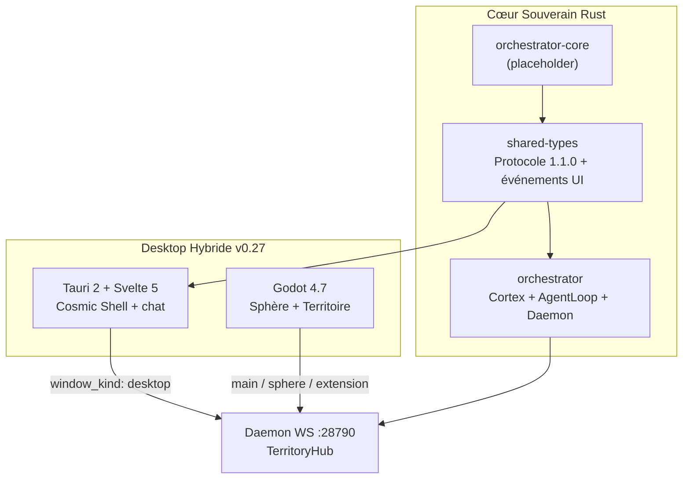

# Architecture Orchestrateur v2 — Phases 21–27

**Version :** 0.27.0 · **Date :** 22 juin 2026 · **Statut :** Livré

## Vue d'ensemble



## Séparation des responsabilités

| Composant | Rôle | Source de vérité |
|-----------|------|------------------|
| `shared-types` | Protocole WS, `BackendEvent`, export TS | Rust + `ts-rs` |
| `orchestrator` | Cortex, bridge, daemon WS, gateway | Logique métier |
| `orchestrator-core` | Future extraction AgentLoop/Cortex runtime | Placeholder |
| `apps/tauri-desktop` | Apparence 2 cosmique (trou noir chat) + lancement Godot | Svelte 5 + Tauri commands |
| `territoire-graphique` | Boule de Pixels Vivante + territoire 3D | Client Godot réactif |

**Principe :** le daemon Rust orchestre ; Tauri et Godot sont des clients WS indépendants.

## Types de fenêtre (`window_kind`)

| Valeur | Client | brain_pulse | Actions critiques |
|--------|--------|-------------|-------------------|
| `desktop` | Tauri | ✅ (UI activité) | ❌ Assimilate / ExecuteSkill |
| `sphere` | Godot SphereDedicated | ✅ (rendu 3D) | ❌ |
| `main` | Godot MainTerritory | ✅ | ✅ |
| `extension` | Godot panneau détaché | selon abonnements | ❌ |

## Protocole WebSocket

- **URL :** `ws://127.0.0.1:28790/ws`
- **Santé :** `http://127.0.0.1:28790/health` (+ `connected_windows`)
- **Auth :** `connect` + `ORCHESTRATEUR_DAEMON_TOKEN` (défaut `dev`)
- **Version :** `1.1.0`

Documentation : [`protocol-ws.md`](protocol-ws.md) · [`territoire-graphique/communication.md`](../territoire-graphique/communication.md)

## Phases 21–27 (livrées)

| Phase | Version | Livrable clé |
|-------|---------|--------------|
| 21 | 0.22.0 | Socle hybride, shared-types, Tauri squelette |
| 22 | 0.22.0 | UI J.A.R.V.I.S., design system |
| 23 | 0.23.0 | WS temps réel, métriques, protocole 1.1.0 |
| 24 | 0.24.0 | AINeuralBrainSphere premium, SphereDedicated |
| 25 | 0.25.0 | Multi-fenêtrage Tauri → Godot, `connected_windows` |
| 26 | 0.26.0 | Polish UI, release hybride, démo storyboard |
| 27 | 0.27.0 | Apparence 2 cosmique, trou noir canvas, drawers |

## Lancement développement

```powershell
# Terminal 1 — daemon
$env:ORCHESTRATEUR_DAEMON_TOKEN = "dev"
just daemon

# Terminal 2 — desktop Tauri
just desktop-dev
# Sidebar → Ouvrir Sphère (Godot 4.7 requis)
```

## Build release

```powershell
just release-v26
.\scripts\tag-phase-release.ps1 -Phase 26
```

Variables frontend (`.env` — voir `apps/tauri-desktop/.env.example`) :

```
VITE_ORCHESTRATEUR_WS_URL=ws://127.0.0.1:28790/ws
VITE_ORCHESTRATEUR_DAEMON_TOKEN=dev
```

## Génération types TypeScript

```bash
cargo run -p shared-types --bin export-ts
# ou : just export-types
```