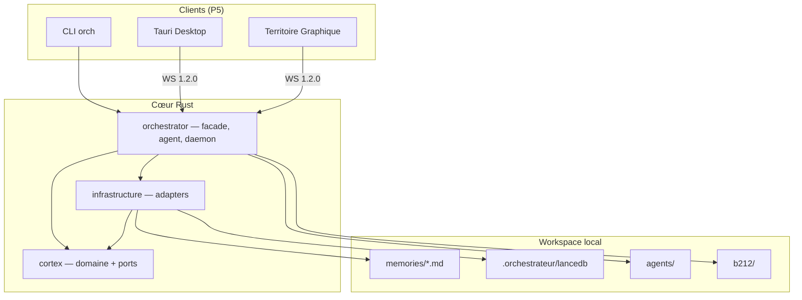

# Architecture Orchestrateur — Vue d'ensemble

**Version :** 0.28.0 · **Phase 7** · **Juin 2026**

> Document canonique. Contenu détaillé historique : [`architecture.md`](architecture.md) · Hiérarchie P0–P6 : [`project-hierarchy.md`](project-hierarchy.md)

## Mantra

> **Cortex first, agent second, gateway third.**



## Crates et responsabilités

| Crate | Priorité | Rôle |
|-------|----------|------|
| `cortex` | P0 | Entités (`Memory`, graphe), ports hexagonaux, services purs |
| `infrastructure` | P1 | FS, LanceDB, Ollama/xAI, cache embeddings, wiring |
| `orchestrator` | P2–P3 | Facade, `AgentLoop`, daemon WS, gateway, skills, B212 |
| `orchestrateur-cli` | P4 | Harness headless `orch` |
| `orchestrateur-plugins` | P6 | Marketplace skills, manifests |
| `apps/tauri-desktop` | P5 | Client desktop cosmique |
| `territoire-graphique` | P5 | Client Godot 4 (sphère, arcs synaptiques) |

## Flux agent (Phase 7)

1. **Contexte** — recherche proactive + graphe injectés avant le LLM
2. **Boucle outils** — blocs ` ```tool ` JSON → registre `memory_*` / outils étendus
3. **Session** — SQLite `.orchestrateur/sessions.db`
4. **Auto-assimilation** — tour substantiel → mémoire Markdown + index vectoriel
5. **Audit** — journal chaîné BLAKE3 `logs/audit.jsonl`

## Sécurité

| Couche | Mécanisme |
|--------|-----------|
| Validation LLM | Anti-injection, scoring gradué |
| Comportemental | Rate limiting assimilations / recherches |
| Intégrité | Honeypots canari, empreinte config |
| Audit | Append-only tamper-evident |

## Distribution

- **CI** : `.github/workflows/ci.yml` (tests rapides + heavy)
- **Release** : `.github/workflows/release.yml` + `scripts/release.sh`
- **Install** : `install.ps1` / `install.sh`

## Documentation associée

| Sujet | Fichier |
|-------|---------|
| Développement | [`DEVELOPER_GUIDE.md`](DEVELOPER_GUIDE.md) |
| Utilisation | [`USER_GUIDE.md`](USER_GUIDE.md) |
| B212 trading | [`B212_INTEGRATION.md`](B212_INTEGRATION.md) |
| Outils agent | [`agent-tools.md`](agent-tools.md) |
| Skills | [`skills-schema.md`](skills-schema.md) |
| Protocole WS | [`protocol-ws.md`](protocol-ws.md) |