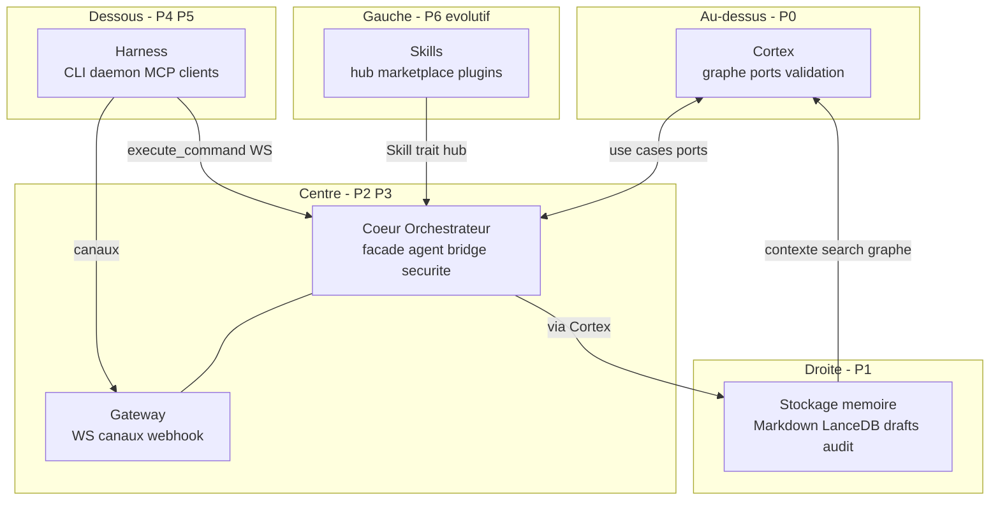
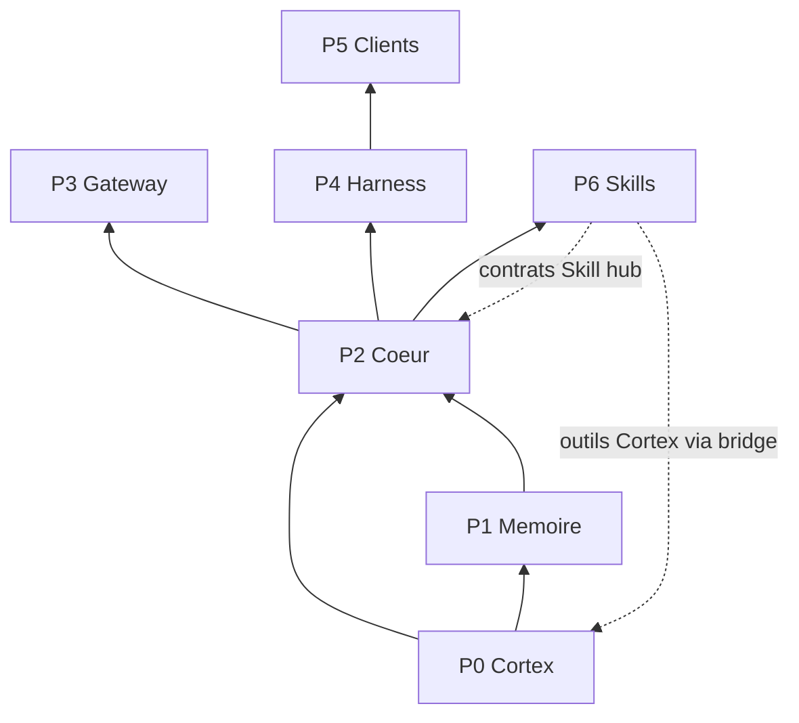

# Hiérarchie du projet Orchestrateur

**Version :** 0.28.0 · **Protocole WS :** 1.2.0 · **Document canonique** pour l'arborescence, les priorités et la frontière « noyau figé / skills évolutives ».

Voir aussi : [`architecture.md`](architecture.md) · [`harness-integral.md`](harness-integral.md) · [`protocol-ws.md`](protocol-ws.md)

---

## 1. Mantra et carte spatiale

> **Cortex first, agent second, gateway third.**



| Zone | Priorité | Rôle |
|------|----------|------|
| Cortex (haut) | P0 | Source de vérité métier — mémoires, graphe, ports hexagonaux |
| Cœur + Gateway (centre) | P2, P3 | Esprit (agent, bridge) + canaux entrants (3e priorité produit) |
| Skills (gauche) | P6 | Extensions Esprit — **seule couche évolutive** après gel du noyau |
| Mémoire (droite) | P1 | Persistance via adapters (fichiers, LanceDB, audit) |
| Harness (bas) | P4, P5 | Surface opérateur : CLI, daemon, MCP, clients visuels |

---

## 2. Suite logique — qui a besoin de qui (P0 → P6)

Ordre de **dépendance** : un bloc ne peut être validé / figé que si ceux dont il dépend le sont déjà.



| Priorité | Bloc | Dépend de | Doit être figé avant | Emplacement |
|----------|------|-----------|----------------------|-------------|
| **P0** | Cortex | — | — | `crates/cortex` |
| **P1** | Mémoire | P0 | P0 | `crates/infrastructure`, `workspace/memories`, `.orchestrateur/lancedb` |
| **P2** | Cœur | P0, P1 | P0, P1 | `crates/orchestrator` (facade, agent, bridge, security, watcher, drafts) |
| **P3** | Gateway | P2 | P2 | `orchestrator::gateway` |
| **P4** | Harness | P2 (+ P3 si canaux) | P2 | `crates/cli`, daemon WS, `crates/shared-types`, `crates/mcp` |
| **P5** | Clients | P4 protocole | P4 | `apps/tauri-desktop`, `territoire-graphique` (cible : sous `apps/`) |
| **P6** | Skills | Contrats P2 + outils P0 | **P2 gelé** | `workspace/skills/`, `plugins/`, marketplace |

**Règle :** après gel, P6 ne dépend plus du **code source** mutable de P2 — uniquement de **contrats versionnés** (trait `Skill`, manifest hub, `Command`/`Response`, outils MCP, profils de capacités).

### Sens des communications

| Lien | Règle |
|------|-------|
| Cortex ↔ Cœur | Toute persistance passe par Cortex (use cases / facade) |
| Skills → Cœur | `Skill::execute`, hub subprocess — **jamais** d'écriture mémoire directe |
| Skills → Cortex | Indirect via outils bridge (`assimilate`, `search`, `draft_publish`, …) |
| Cœur → Mémoire | Via ports infrastructure (adapters remplaçables) |
| Harness → Cœur | `execute_command`, bootstrap — pas de logique métier dupliquée dans la CLI |
| Clients → Harness | WS `1.2.0`, `/health` — UI remplaçable |
| Gateway → Cœur | Inbound → tour agent (canal optionnel) |

Référence skills : [`workspace/skills/RESOLVER.md`](../workspace/skills/RESOLVER.md) · Schémas hub/marketplace : [`skills-schema.md`](skills-schema.md).

---

## 3. État actuel du dépôt

```
orchestrateur/
├── crates/
│   ├── shared-types/       # Protocole WS, BackendEvent, export TS
│   ├── cortex/             # P0
│   ├── orchestrator/       # P2 + P3 (gateway, daemon)
│   ├── infrastructure/     # P1
│   ├── mcp/                # Transport MCP (stdio)
│   ├── cli/                # P4 — harness CLI
│   └── client/             # Bridge embarqué (TUI/HUD)
├── apps/
│   └── tauri-desktop/      # P5 — client WS
├── territoire-graphique/   # P5 — client Godot (hors apps/ aujourd'hui)
├── plugins/                # P6 — plugins natifs Rust
├── workspace/              # Données utilisateur dev (≠ Cargo workspace)
│   ├── config/
│   ├── memories/
│   ├── skills/
│   └── .orchestrateur/
├── scripts/                # install.ps1, post-install, release
├── installer/              # Inno Setup
└── docs/
```

### Collision de noms à connaître

| Terme | Signification |
|-------|----------------|
| **Cargo workspace** | `Cargo.toml` à la racine — membres Rust |
| **Dossier `workspace/`** | Données utilisateur par défaut (`--workspace workspace`) |
| **Workspace prod** | `%APPDATA%\Orchestrateur\workspace` après install |

### Écarts connus (doc / install)

- README historique : `Orchestre/` → corrigé en `orchestrateur/`
- MCP : `crates/mcp` (impl) vs `orchestrator/src/mcp/` (ports) — même nom, rôles différents
- Anciennes installs : peuvent encore avoir `orchestre.exe` / `orchestrateur.exe` — supprimer manuellement si présents

---

## 4. État cible (arborescence — roadmap, sans move dans ce doc)

```
orchestrateur/
├── crates/                 # Inchangé en rôles, clarifié en P0–P4
├── apps/
│   ├── desktop-tauri/      # futur : depuis apps/tauri-desktop
│   └── godot-territoire/   # futur : depuis territoire-graphique/
├── plugins/                # P6 natif
├── data/
│   └── default/            # futur : renommer workspace/ (évite collision Cargo)
├── scripts/                # Outillage unique
├── installer/
└── docs/
```

---

## 5. Frontière « Orchestrateur intouchable »

Après validation, le noyau (P0–P5) est **scellé**. Seules les **skills (P6)** évoluent librement.

### Scellé (P0–P5)

- Ports Cortex (`MemoryRepository`, `VectorStore`, `EmbeddingProvider`, …)
- `OrchestratorFacade`, `Command` / `Response` bridge
- Protocole WS daemon + `BackendEvent` (`shared-types`, version `1.2.0`)
- CLI harness (`orch doctor`, `onboard`, `daemon`, `gateway`, …)
- Schéma `orchestrator.toml` (sections stables + versioning)
- Sécurité / egress (`local_only`, `block_cloud_llm`, scan secrets)
- Built-in skills compilées (ensemble minimal, gelées avec P2)
- Gateway et clients (P3, P5) — pas des skills

### Évolutif (P6 seul)

| Type | Emplacement | Sans modifier le noyau Rust |
|------|-------------|----------------------------|
| Skills Markdown | `workspace/skills/*/SKILL.md` | Oui |
| Hub subprocess | manifest TOML + binaire | Oui |
| Plugins natifs | `plugins/*` | Oui (ABI / trait stable) |
| Catalogue marketplace | `catalog.json` | Oui |
| Nouveaux canaux gateway | — | **Non** (reste P3 noyau) |

### Contrats publics pour les skills (API du noyau figé)

- Trait `Skill` : `name`, `description`, `execute(SkillContext) -> SkillOutput`
- Layout hub : `skills_hub.directory`, entrées TOML, empreintes BLAKE3
- Outils MCP : `cortex_*`, `esprit_*`, `draft_*`, `harness_health`
- Profils capacités : `memory`, `agent`, `research`, …

**Politique PR post-gel :** dépôt principal = skills + docs skills ; correctifs Rust = sécurité critique uniquement.

---

## 6. Politique CLI — un exe, trois noms

| Aspect | État |
|--------|------|
| Binaire Cargo / install | **Un seul** `orch.exe` |
| Noms acceptés | Alias **clap** : `orchestre`, `orchestrateur` ([`main.rs`](../crates/cli/src/main.rs)) |
| PATH / Inno | `orch.exe` uniquement |

---

## 7. Checklist validation (avant gel)

1. **P0** — Cortex : ports stables, tests adversariaux verts
2. **P1** — Mémoire : LanceDB, import/reindex, intégrité BLAKE3 config
3. **P2** — Cœur : `orch harness smoke`, `orch doctor`, egress `local_only`, agent + bridge
4. **P4** — Harness : daemon WS live, CLI complète, `orch mcp serve`
5. **P3** — Gateway : si activé — Telegram / Discord / Slack smoke
6. **P5** — Clients : Tauri + Godot sur protocole `1.2.0` figé
7. **Gel** — tag semver + politique « skills-only PRs »
8. **P6** — Skills : évolution libre dans `workspace/skills` et `plugins/`

Actions pré-gel techniques :

- [x] Fusionner ou supprimer `orchestrator-core` (placeholder) — supprimé, logique dans `orchestrator`
- [x] PR-G : binaire CLI unique (`orch.exe`)
- [x] Documenter version schéma hub / marketplace — [`skills-schema.md`](skills-schema.md) (hub v1.0, catalogue v1)

---

## 8. Backlog moves (futur)

| PR | Contenu |
|----|---------|
| A | `territoire-graphique/` → `apps/godot-territoire/` |
| B | `apps/tauri-desktop/` → `apps/desktop-tauri/` |
| C | `workspace/` → `data/default/` (compat `--workspace`) |
| D | Consolider `stage-release.ps1` / `stage-release-v2.ps1` |
| G | Un seul binaire `orch` + install simplifiée | **Fait** |

---

## 9. Mapping rapide crate → zone

| Crate | Zone | Priorité |
|-------|------|----------|
| `cortex` | Cortex | P0 |
| `infrastructure` | Mémoire | P1 |
| `orchestrator` | Cœur + Gateway | P2, P3 |
| `shared-types` | Fil protocole (Harness ↔ clients) | P4 |
| `mcp` | Harness (stdio) | P4 |
| `cli` | Harness | P4 |
| `client` | Harness embarqué | P4 |
| `apps/*`, `territoire-graphique` | Clients | P5 |
| `plugins/*`, `workspace/skills` | Skills | P6 |