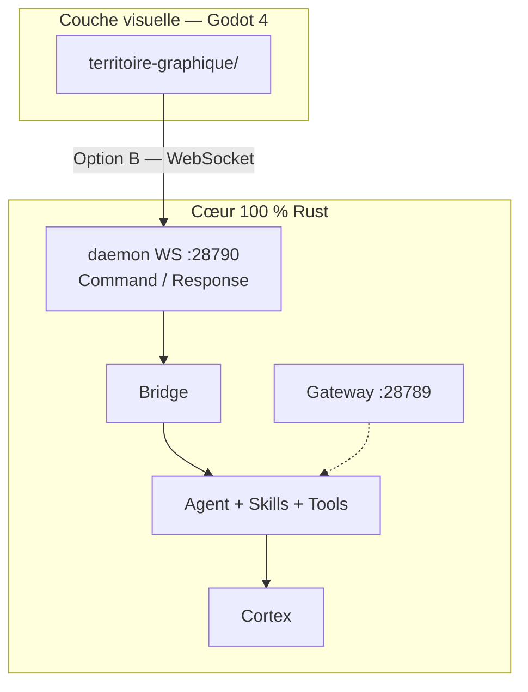

# Orchestrateur — But du projet et fonctionnement (Phase 14 bis)

**Version :** 0.15.0 · **SovenLabs** · Juin 2026

---

## 1. But du projet

**Orchestrateur** est un **second cerveau local et souverain** : mémoires Markdown, graphe de connaissances, recherche vectorielle, agent IA au service du Cortex.

### Mantra

> **Cortex first, agent second, gateway third.**

| Priorité | Couche | Rôle |
|----------|--------|------|
| **1** | **Cortex** | Squelette — mémoires, graphe, LanceDB |
| **2** | **Agent** | Esprit — LLM + outils mémoire natifs |
| **3** | **Gateway** | Canaux messaging optionnels (:28789) |
| — | **Territoire Graphique** | Client Godot 4 via daemon WS (:28790) |
| — | **CLI** | Headless, scripts, automation |

---

## 2. Architecture Phase 14 bis



**Changement Phase 14 bis :** suppression de egui (HUD) et ratatui (TUI). Le cœur IA est intact ; seule la présentation migre vers Godot.

---

## 3. Binaires

| Binaire | Rôle |
|---------|------|
| `orchestrateur.exe` | CLI + `daemon run` + `gateway run` |
| Godot project | Client visuel (Phase 15+) |

```powershell
# Daemon pour Territoire Graphique
$env:ORCHESTRATEUR_DAEMON_TOKEN = "secret"
.\orchestrateur.exe daemon run --workspace workspace
```

---

## 4. Données (`workspace/`)

```
workspace/
├── config/orchestrator.toml   # [daemon] port 28790, [gateway] port 28789
├── memories/*.md
├── logs/
└── .orchestrateur/lancedb/
```

---

## 5. Documentation

- Protocole WS : [`territoire-graphique/communication.md`](../territoire-graphique/communication.md)
- Phase 14 bis : [`docs/Phase_14_bis_Refonte_Langages_Nettoyage.md`](../docs/Phase_14_bis_Refonte_Langages_Nettoyage.md)
- README : [`README.md`](../README.md)