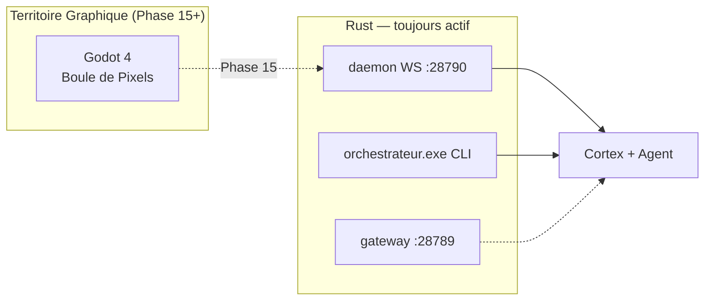
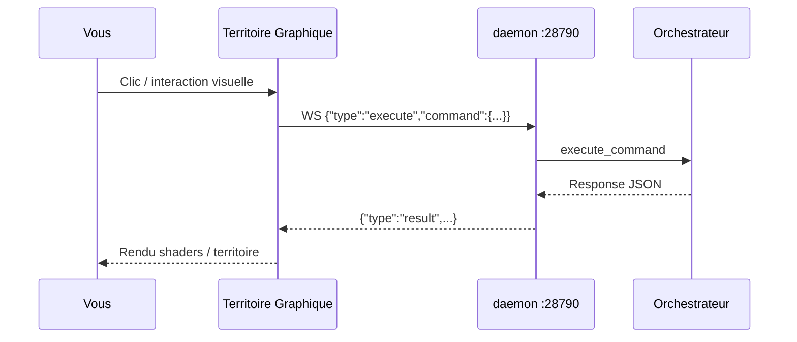

# Orchestrateur — Interface graphique et interactions (Phase 14 bis)

**Version :** 0.15.0 · Juin 2026

> **Changement majeur Phase 14 bis :** les anciennes interfaces egui (HUD) et ratatui (TUI) ont été supprimées. La couche visuelle est désormais **Territoire Graphique** (Godot 4), client du daemon WebSocket Rust.

---

## 1. Y a-t-il une application ? Un moteur graphique ?

| Question | Réponse (état actuel) |
|----------|----------------------|
| **Application desktop ?** | **En transition** — Godot 4 dans `territoire-graphique/` (Phase 15) |
| **Ancienne app egui ?** | **Supprimée** (`orchestrateur-hud.exe`) |
| **Ancienne TUI ?** | **Supprimée** (`orchestrateur-tui`) |
| **Moteur graphique cible ?** | **Godot 4** — shaders, particules, territoire multi-fenêtres |
| **Backend / cerveau ?** | **Rust** — inchangé (Cortex + Agent + daemon WS) |

---

## 2. Où interagir aujourd'hui ?



### Daemon Territoire Graphique (interface principale future)

```powershell
$env:ORCHESTRATEUR_DAEMON_TOKEN = "secret"
.\orchestrateur.exe daemon run --workspace workspace
```

- URL : `ws://127.0.0.1:28790/ws`
- Protocole : [`territoire-graphique/communication.md`](../territoire-graphique/communication.md)
- Le client Godot enverra des `Command` JSON (liste, recherche, chat, assimilation…)

### CLI headless (disponible maintenant)

```powershell
.\orchestrateur.exe list --workspace workspace
.\orchestrateur.exe search "ma requête" --workspace workspace
.\orchestrateur.exe chat "Bonjour" --workspace workspace
```

### Gateway (canaux messaging — pas l'UI principale)

```powershell
.\orchestrateur.exe gateway run --workspace workspace
```

Port **28789** — Telegram, Discord, webhooks, etc.

---

## 3. Où cliquer ? Où chatter ? (après Phase 15)

| Action | Où (futur Godot) | Où (maintenant) |
|--------|------------------|-----------------|
| Voir les mémoires | Territoire Graphique | `orchestrateur list` ou daemon `List` |
| Rechercher | Territoire Graphique | `orchestrateur search` ou daemon `Search` |
| Chatter avec l'IA | Territoire Graphique | `orchestrateur chat` ou daemon `Chat` |
| Assimiler du savoir | Territoire Graphique | `orchestrateur assimilate` ou daemon `Assimilate` |
| Voir le graphe | Territoire Graphique (visuel) | `orchestrateur graph` ou daemon `Graph` |

---

## 4. Ce qui n'existe plus

- `orchestrateur-hud.exe` (egui)
- `orchestrateur-tui` (ratatui)
- Onglets Explorateur / Graphe / Audit / Chat egui
- TUI clavier `j/k/c/a/g`

---

## 5. Schéma — communication Option B



**En résumé :** le rendu graphique migre vers **Godot 4** ; le **cerveau reste Rust** ; vous interagissez via le **daemon WebSocket** (client Godot) ou le **CLI** en attendant la Phase 15.