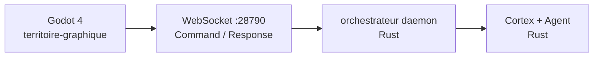

# Territoire Graphique

Couche de présentation visuelle disruptive pour **Orchestrateur** — client Godot 4 connecté au daemon Rust via WebSocket local (Option B).

## Structure

```
territoire-graphique/
├── communication.md          # Protocole WS Command/Response
├── godot-project/            # Projet Godot 4 (Phase 15+)
│   └── project.godot
└── rust-gdextension/         # GDExtension Rust (Phase 15+)
    └── src/lib.rs
```

## Démarrage (Phase 14 bis)

1. Lancer le daemon Rust :

```powershell
$env:ORCHESTRATEUR_DAEMON_TOKEN = "secret"
.\target\release\orchestrateur.exe daemon run --workspace workspace
```

2. Ouvrir `godot-project/` dans Godot 4 (Phase 15 : connexion WS basique).

## Architecture



Le client Godot est **remplaçable** (Bevy, autre moteur) sans toucher au cœur IA Rust.