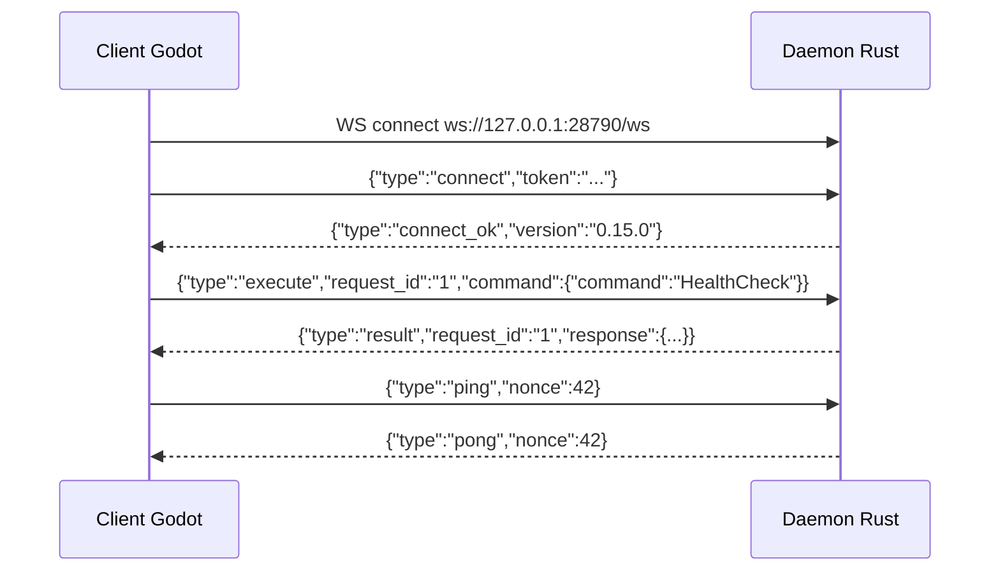

# Protocole de communication — Territoire Graphique (Option B)

**Version :** 0.15.0 · **Transport :** WebSocket local · **Sérialisation :** JSON

---

## Vue d'ensemble

Le daemon Rust (`orchestrateur daemon run`) expose le contrat bridge [`Command`](../crates/orchestrator/src/bridge/command.rs) / [`Response`](../crates/orchestrator/src/bridge/response.rs) sur WebSocket.

| Élément | Valeur par défaut |
|---------|-------------------|
| URL | `ws://127.0.0.1:28790/ws` |
| Santé HTTP | `http://127.0.0.1:28790/health` |
| Config | `[daemon]` dans `orchestrator.toml` |
| Token | Variable `ORCHESTRATEUR_DAEMON_TOKEN` |

**Différence avec le gateway (port 28789) :** le daemon expose le **bridge complet** (liste, recherche, chat, assimilation, graphe, audit, skills). Le gateway cible les **canaux messaging** et le protocole agent streaming.

---

## Séquence de connexion



---

## Messages client → daemon

Tous les messages sont du JSON texte sur le WebSocket.

### `connect` — authentification obligatoire

```json
{
  "type": "connect",
  "token": "votre-token-secret",
  "client": {
    "window_kind": "main",
    "panels": ["chat", "memory", "graph", "monitoring"],
    "subscriptions": ["activity", "memories", "graph", "chat", "brain_pulse"]
  }
}
```

`client` est optionnel (défaut : `window_kind: main`). Pour une fenêtre d'extension Godot : `window_kind: "extension"`, `panels: ["graph"]`, etc.

Le token doit correspondre à la variable d'environnement configurée (`ORCHESTRATEUR_DAEMON_TOKEN` par défaut).

### `execute` — exécuter une commande bridge

```json
{
  "type": "execute",
  "request_id": "uuid-ou-correlation-id",
  "command": {
    "command": "List",
    "payload": {
      "filter": null,
      "offset": 0,
      "limit": 100
    }
  }
}
```

Exemples de commandes (`command` field) :

| Commande | Exemple payload |
|----------|-----------------|
| `HealthCheck` | *(pas de payload)* `{"command":"HealthCheck"}` |
| `List` | `{"command":"List","payload":{"filter":null,"offset":0,"limit":50}}` |
| `Search` | `{"command":"Search","payload":{"query":"rust architecture","limit":10}}` |
| `GetMemory` | `{"command":"GetMemory","payload":{"id":"<uuid>"}}` |
| `Chat` | `{"command":"Chat","payload":{"message":"Bonjour"}}` |
| `Assimilate` | `{"command":"Assimilate","payload":{"text":"...","tags":["note"]}}` |
| `Graph` | `{"command":"Graph"}` |
| `Audit` | `{"command":"Audit","payload":{"limit":50}}` |
| `ListSkills` | `{"command":"ListSkills"}` |

### `ping` — keepalive

```json
{
  "type": "ping",
  "nonce": 42
}
```

---

## Messages daemon → client

### `connect_ok`

```json
{
  "type": "connect_ok",
  "version": "0.19.0",
  "session_id": "uuid-client-ws",
  "territory_session_id": "uuid-territoire-daemon"
}
```

### `broadcast` — synchronisation multi-fenêtres (Phase 18)

Émis par le daemon vers les clients abonnés (pas de réponse client requise).

```json
{
  "type": "broadcast",
  "territory_session_id": "uuid-territoire-daemon",
  "event": "memories_changed",
  "source_session_id": "uuid-client-source",
  "payload": {}
}
```

Événements : `memories_changed`, `graph_changed`, `brain_pulse`, `chat_reply`, `memory_assimilated`, `tool_call`, `vector_search`, `system_error`, `degraded_mode`.

Topic générique `visual` reçoit tous les effets boule (fenêtre principale).

### `result`

```json
{
  "type": "result",
  "request_id": "uuid-ou-correlation-id",
  "response": {
    "response": "Health",
    "payload": {
      "status": "ok",
      "version": "0.15.0",
      "llm_available": true,
      "embedding_available": true
    }
  }
}
```

Le champ `response` suit le format taggé [`Response`](../crates/orchestrator/src/bridge/response.rs) (`response` + `payload`).

### `pong`

```json
{
  "type": "pong",
  "nonce": 42
}
```

### `error`

```json
{
  "type": "error",
  "request_id": "uuid-optionnel",
  "message": "token invalide ou absent"
}
```

---

## Santé HTTP

```bash
curl http://127.0.0.1:28790/health
```

```json
{
  "status": "ok",
  "version": "0.19.0",
  "port": 28790,
  "territory_session_id": "uuid-territoire-daemon",
  "connected_clients": 2
}
```

---

## Configuration TOML

```toml
[daemon]
enabled = true
bind = "127.0.0.1"
port = 28790
token_env = "ORCHESTRATEUR_DAEMON_TOKEN"
```

---

## Lancement

```powershell
$env:ORCHESTRATEUR_DAEMON_TOKEN = "secret"
.\orchestrateur.exe daemon run --workspace workspace
```

Surcharge port/bind en CLI :

```powershell
.\orchestrateur.exe daemon run --workspace workspace --port 28791 --bind 127.0.0.1
```

---

## Notes Phase 15

- Le client Godot implémentera un `WebSocketPeer` natif ou une GDExtension Rust pour la sérialisation JSON.
- Le streaming agent (`AgentStreamDelta`) reste sur le **gateway** ; le daemon expose le bridge synchrone `Command`/`Response`.
- Migration future vers Bevy : remplacer uniquement `territoire-graphique/`, le daemon Rust reste inchangé.